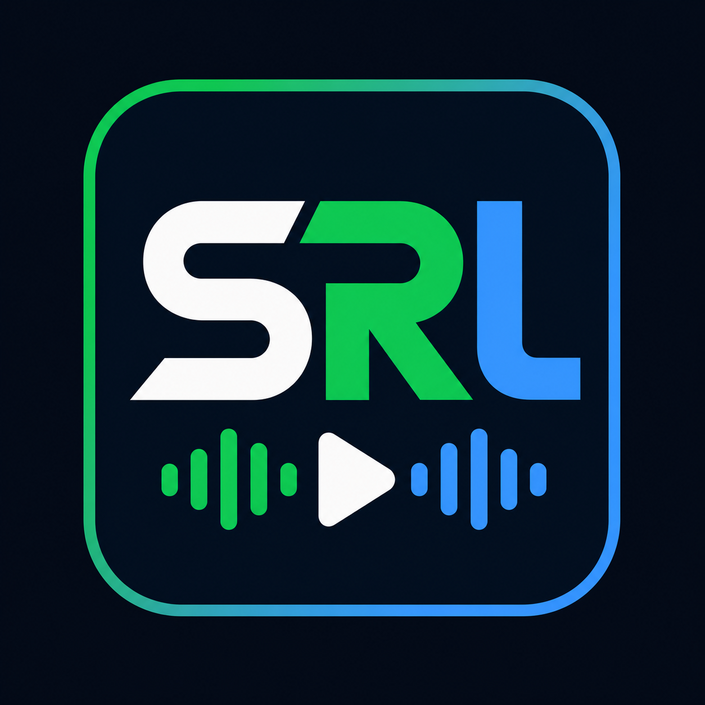

<p align="center">
  
</p>

<h1 align="center">Song Request Linux</h1>

<p align="center">
  Pedidos de musica para lives na Twitch, feito para Linux, com Spotify, YouTube via Pear, YouTube via OBS Browser, OBS overlay e dashboard local.
</p>

<p align="center">
  <a href="README_EN.md">English</a> ·
  <a href="docs/SETUP.md">Guia rapido</a> ·
  <a href="#instalar">Instalar</a> ·
  <a href="#como-funciona">Como funciona</a> ·
  <a href="#comandos">Comandos</a> ·
  <a href="#obs">OBS</a>
</p>

---

Song Request Linux e um app local para streamers que querem aceitar pedidos de
musica pelo chat da Twitch no Linux. Ele roda em `127.0.0.1`, abre um dashboard
no navegador, controla a fila e entrega overlays para OBS.

O app foi pensado para evitar dependencias Windows-only, WebView2 e Wine. O
fluxo atual e simples: escolha um modo principal, conecte o bot da Twitch,
configure o player e adicione o overlay no OBS.

## Instalar

### Pacote tar.gz

O pacote `.tar.gz` ja traz o binario compilado. O usuario comum nao precisa instalar Rust, Cargo ou Git. Ao instalar, o app fica em `~/.local/share/song-request-linux/app`.

```bash
tar -xzf song-request-linux-0.1.16-linux-x86_64.tar.gz
cd song-request-linux-0.1.16-linux-x86_64
./scripts/check-runtime-prereqs
./scripts/install-desktop-entry
./scripts/song-request-linux-open
```

Pre-requisitos opcionais por modo:

- `Spotify`: app Spotify aberto no PC e conta Premium.
- `YouTube/Pear`: Pear Desktop instalado, aberto e com API Server ativo.
- `YouTube/OBS`: `yt-dlp` instalado para o player `/player` resolver audio do YouTube.

### Windows experimental

Baixe o pacote `.zip`, extraia em uma pasta simples e abra:

```text
Start-SongRequestLinux.cmd
```

O painel abre em `http://127.0.0.1:7384/`. Para fechar, use `Encerrar` no painel ou `Stop-SongRequestLinux.cmd`.

Dados locais no Windows:

```text
%APPDATA%\song-request-linux
%LOCALAPPDATA%\song-request-linux
```

### CachyOS/Arch via Git

Use o instalador amigavel se quiser atualizar direto pelo GitHub:

```bash
git clone https://github.com/heyleao/song-request-linux.git
cd song-request-linux
./scripts/install-user-friendly --with-pear
```

Abrir:

```bash
./scripts/song-request-linux-open
```

Parar:

```bash
./scripts/song-request-linux-stop
```

Atualizar pelo GitHub:

Use o botao `Atualizar pelo GitHub` no painel. Ele chama o backend local,
baixa o GitHub, recompila e reinicia o app. Ao voltar, o painel informa se
baixou uma versao nova ou se ja estava atualizado.

Se o painel nao abrir, rode manualmente:

```bash
./scripts/update-from-github --restart
```

Remover o app mantendo configs, tokens, logs e fila:

```bash
./scripts/uninstall-user
```

Remover tudo, incluindo dados locais:

```bash
./scripts/uninstall-user --remove-data
```

## Como Funciona


1. Abra o dashboard.
2. Na tela `Operacao`, escolha o modo no card `Provider ativo`:
   - `Spotify`: pedidos por texto buscam e tocam no Spotify.
   - `YouTube/Pear`: o SRL busca/valida no YouTube e toca no Pear Desktop.
   - `YouTube/OBS`: o SRL busca/valida no YouTube e toca no Browser Source do OBS.
3. Va em `Configuracao`.
4. Configure apenas o bloco do modo escolhido.
5. Conecte o bot da Twitch.
6. Salve a configuracao.
7. Teste um pedido no dashboard ou no chat.
8. Adicione o overlay no OBS.

Importante: use um modo ativo por vez: Spotify, YouTube via Pear ou YouTube via
OBS Browser. Texto segue o modo ativo. Links diretos do YouTube entram como
YouTube e usam menos API.

## Spotify

Use Spotify quando quiser pedidos por busca no Spotify e playlist fallback.

Requisitos:

- Spotify Premium.
- App Spotify aberto no PC da live.
- Um device ativo no PC antes de aceitar pedidos.
- `Client ID` criado no dashboard de desenvolvedor do Spotify.

Redirect URI do Spotify:

```text
http://127.0.0.1:7384/auth/spotify/callback
```

O app evita transferir playback para celular. Se nao houver device valido no PC
da live, o dashboard mostra erro e pede para abrir/tocar algo no Spotify local.

## YouTube: Pear ou OBS Browser

Use YouTube quando quiser tocar pedidos via Pear Desktop ou via Browser Source do OBS.

A YouTube Data API v3 e usada pelo SRL para busca por texto, validacao de duracao/categoria e escolha do video. Ela vale para YouTube/Pear e YouTube/OBS Browser.

O Pear nao usa essa API Key como login. O Pear toca usando a conta Google/YouTube logada dentro do proprio Pear.

Requisitos para pedidos por texto:

- YouTube Data API v3 ativa.
- Uma ou mais API Keys salvas no dashboard.

Requisitos para Pear:

- Pear Desktop aberto.
- Plugin `API Server` do Pear ativo.

Config recomendada do Pear:

```text
Porta: 26538
Authorization: No Authorization
API: http://127.0.0.1:26538/api/v1
```

Busca por texto no YouTube usa YouTube Data API e pode bater limite de quota.
Cole varias API Keys, uma por linha, para o app tentar a proxima quando uma
falhar. Links diretos do YouTube dependem menos da API, mas ainda podem usar
validacao de duracao/categoria.

O app envia pedidos para a fila do Pear quando Pear Desktop e escolhido. O Pear e
um app externo; se ele estiver fechado ou com API desligada, o pedido pode entrar
na fila do SRL, mas nao vai tocar ate o Pear voltar.

## Fila e Fallback

- Pedido aceito entra na fila do app.
- Quando a fila tem pedidos, eles devem tocar antes da playlist fallback.
- Quando a fila fica vazia, o fallback pode voltar.
- A playlist fallback e opcional.
- A persistencia da fila tambem e opcional.

Persistencia marcada:

```text
O app salva a fila e continua depois de fechar/abrir.
```

Persistencia desmarcada:

```text
A proxima abertura comeca com fila limpa.
```

## OBS

Dashboard:

```text
http://127.0.0.1:7384/
```

Overlay recomendado:

```text
http://127.0.0.1:7384/overlay?max=48&width=520&size=24&lines=2
```

Tamanho recomendado da Browser Source:

```text
Largura: 620
Altura: 150
```

O parametro `width=520` controla a largura interna do texto. Use `lines=2` para
permitir duas linhas no nome da musica. O texto do topo pode ser alterado no
Setup ou com `label=Texto` na URL.

Player OBS para YouTube:

```text
http://127.0.0.1:7384/player
```

Use o player OBS apenas se voce escolheu `Browser Source OBS` como player do
YouTube. Se usa Pear Desktop, nao adicione essa fonte.

No OBS Browser Source:

1. Cole `http://127.0.0.1:7384/player`.
2. Marque `Controlar audio via OBS`.
3. Mantenha a fonte ativa na cena.

Para ouvir essa musica no fone do streamer:

1. Na fonte Browser Source do player, marque `Controlar audio via OBS`.
2. No Mixer de audio, abra as propriedades avancadas de audio.
3. Na linha dessa fonte, coloque `Monitorar e enviar saida`.
4. Ajuste o volume pelo mixer do OBS. O comando `!vol` nao controla o OBS Browser.

## Comandos


Padrao para todos:

```text
!sr nome da musica
!sr https://youtu.be/VIDEO_ID
!song
!fila
!queue
!q
!rm
!remove
!vol
!comandos
```

Padrao para moderador/streamer:

```text
!skip
!vol 30
!play
!pause
!next
```

Na aba `Configuracao`, cada comando tem sua propria caixa de aliases e permissao.
Exemplo: voce pode trocar `!sr` por `!ssr`.

Permissoes disponiveis:

```text
Todos
Subscriber
VIP
Moderador
Streamer
```

Limites de pedidos por cargo:

```text
0 = sem limite
1..100 = maximo de pedidos pendentes daquele cargo
```

O limite conta a musica atual e as proximas musicas do mesmo solicitante.

## Licenca

GPL-3.0-or-later.
