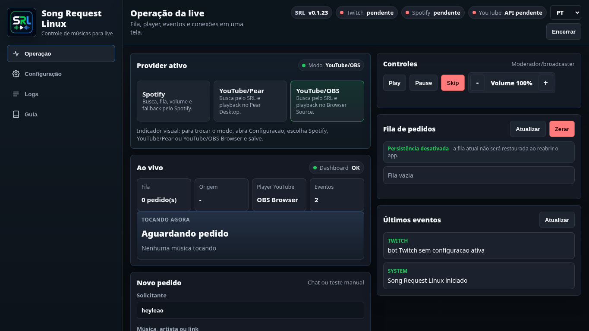
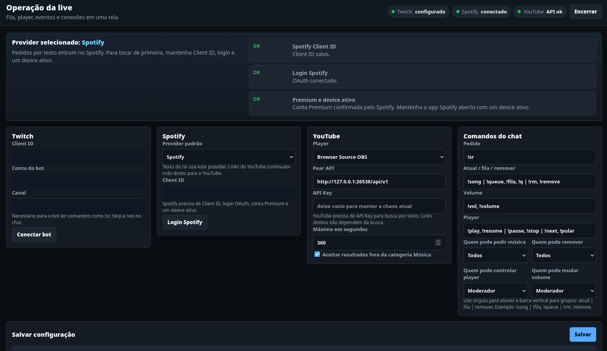
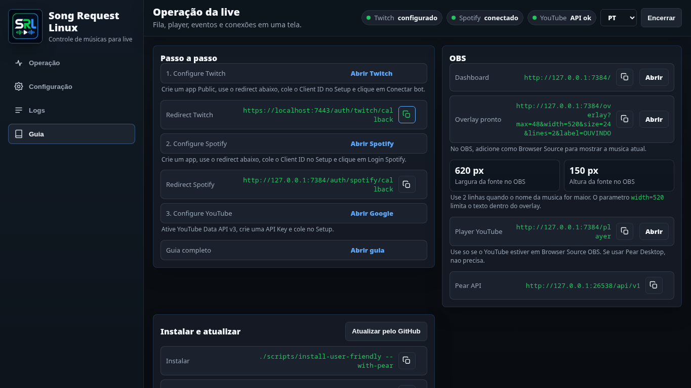
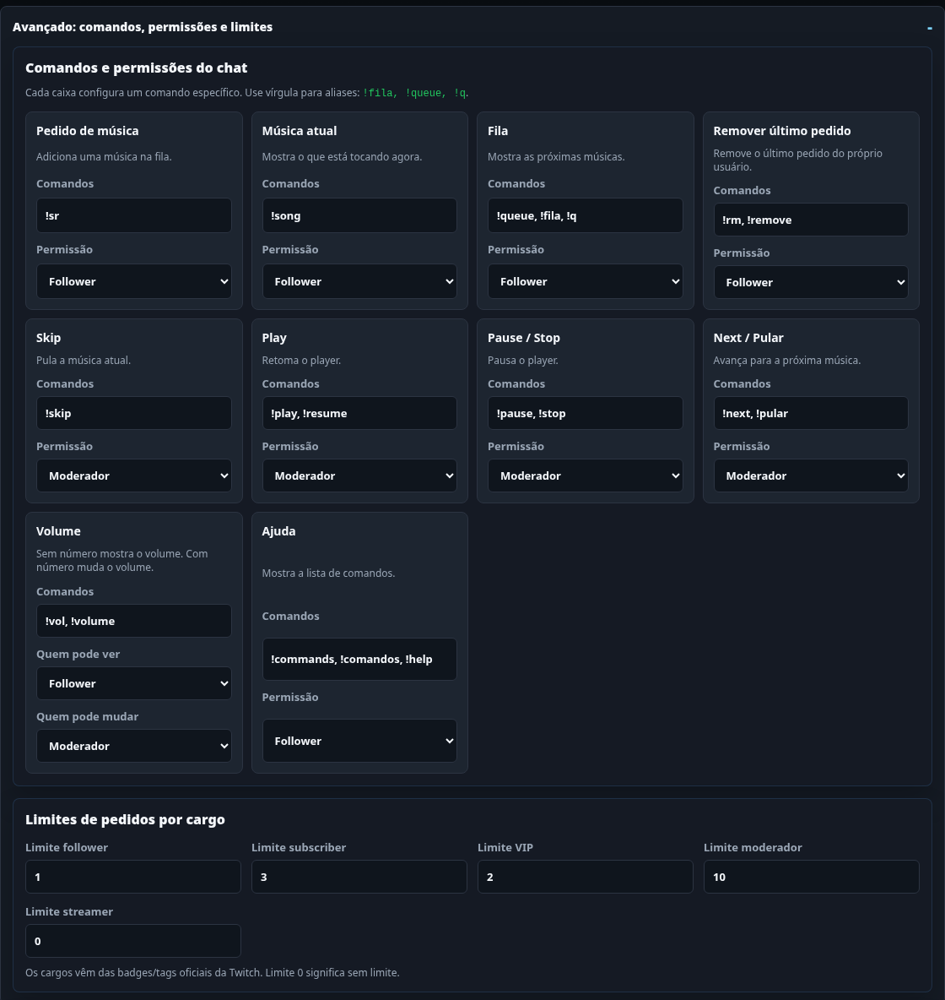

# Quick Setup

This is the short recipe to get Song Request Linux ready for a stream. Do one step at a time.

## 1. Install and Open

On CachyOS/Arch:

```bash
git clone https://github.com/heyleao/song-request-linux.git
cd song-request-linux
./scripts/install-user-friendly --with-pear
```

Open after installing:

```bash
./scripts/song-request-linux-open
```

Dashboard:

```text
http://127.0.0.1:7384/
```

## 2. Main Screen



The main screen shows:

- active provider;
- now playing;
- request queue;
- recent events;
- play, pause, skip, and volume buttons.

## 3. Choose Mode

On the main `Live` screen, choose one provider in the `Active provider` card.



Use `Spotify` if you want to:

- search songs by name on Spotify;
- control play, pause, skip, and volume on Spotify;
- use Spotify fallback playlist when the queue is empty.

Use `YouTube/Pear` if you want to:

- search songs by name on YouTube;
- play through Pear Desktop;
- accept direct YouTube links.

Use one mode at a time. If you change the provider, save settings.

## 4. Twitch

The Twitch bot reads chat and replies to commands.

1. Open https://dev.twitch.tv/console/apps
2. Create an app.
3. App type: `Public`.
4. Redirect URL:

```text
https://localhost:7443/auth/twitch/callback
```

5. Copy the `Client ID`.
6. In Song Request Linux, fill in:
   - `Twitch Client ID`
   - `Bot account`
   - `Channel`
7. Click `Save`.
8. Click `Connect bot`.
9. Log in with the bot account, not your main account.

It is ready when the top status shows Twitch as configured.

## 5. Spotify

Skip this if you only use YouTube/Pear.

1. Open https://developer.spotify.com/dashboard
2. Create an app.
3. Add this Redirect URI:

```text
http://127.0.0.1:7384/auth/spotify/callback
```

4. Copy the `Client ID`.
5. Paste it in `Spotify Client ID`.
6. Click `Save`.
7. Click `Spotify login`.
8. Log in with your Spotify account.

Important:

- Spotify Premium is required;
- open Spotify on the stream PC;
- leave one song ready or playing;
- the app should not send playback to a phone.

If you get a device error, open Spotify on the PC, press play on any song, and try again.

## 6. Fallback Playlist

Use fallback if you want music when there are no requests.

1. Enable `Play fallback playlist when there are no requests`.
2. Click `Load playlists`.
3. Choose the playlist.
4. Save.

If disabled, the app will not return to the playlist by itself.

## 7. Queue Persistence

This decides what happens when closing and reopening the app.

Enabled:

```text
The queue is saved and restored next time.
```

Disabled:

```text
The next stream starts with an empty queue.
```

Disable it if you always want a clean stream start.

## 8. YouTube/Pear

Skip this if you only use Spotify.

### YouTube API

1. Open https://console.cloud.google.com/apis/credentials
2. Create or choose a project.
3. Enable `YouTube Data API v3`.
4. Create an `API Key`.
5. Paste the key in Song Request Linux.
6. Save.

### Pear Desktop

1. Open Pear Desktop.
2. Enable the `API Server` plugin.
3. Use port `26538`.
4. Set `Authorization` to `No Authorization`.
5. Restart Pear.

In Song Request Linux, use:

```text
http://127.0.0.1:26538/api/v1
```

If Pear is closed, the song may enter SRL's queue but will not play until Pear is open and the API is active.

## 9. OBS

Add a Browser Source for the overlay.



URL:

```text
http://127.0.0.1:7384/overlay?max=48&width=520&size=24&lines=2
```

Source size:

```text
Width: 620
Height: 150
```

The `width=520` parameter keeps text inside the overlay. Use `lines=2` for two song-title lines. The top label can be changed in Setup or with `label=Text` in the URL.

YouTube player source:

```text
http://127.0.0.1:7384/player
```

Use this only if YouTube playback is set to `Browser Source OBS`. If you use Pear, you normally do not need it.

## 10. Chat Commands

Requests:

```text
!sr song name
!sr youtube_link
```

Current song and queue:

```text
!song
!fila
!queue
!q
```

Remove the user's last request:

```text
!remove
!rm
```

Volume:

```text
!vol
!vol 30
```

Moderator/streamer controls:

```text
!skip
!play
!pause
!next
```

In setup, you can change commands and choose who can use each one.



Recognized roles:

```text
Streamer
Moderator
VIP
Subscriber
Follower
```

Follower note: Twitch IRC does not reliably tag normal chatters as followers. SRL treats a normal chatter as Follower; to strictly block non-followers, enable follower-only mode in Twitch chat.

## 11. Per-role Limits

In advanced setup, define how many pending songs each role can have.

Example:

```text
Follower: 1
Subscriber: 3
VIP: 3
Moderator: 10
Streamer: 0
```

`0` means unlimited.

The limit counts the current song and the next songs from the same user.

## 12. Test Before Going Live

1. Check if the top bar shows Twitch, provider, and API as configured.
2. Send a manual request from the dashboard.
3. Check if it appears in `Request queue`.
4. Check if the player plays.
5. Test in chat:

```text
!sr system of a down spiders
!song
```

## 13. Close

From the dashboard, click `Quit`.

Or run:

```bash
./scripts/song-request-linux-stop
```

## 14. Troubleshooting

Open the `Logs` tab.

Common problems:

- Spotify does not play: open Spotify on the PC and press play.
- Spotify says there is no device: the app did not find a valid local device.
- Twitch does not reply: check if you connected the bot account.
- YouTube does not search: check the API key and YouTube Data API v3.
- Pear does not play: check if Pear is open and API Server is enabled.
- OBS does not show the overlay: check the URL and Browser Source size.
- A mod cannot add more songs: check per-role request limits.
